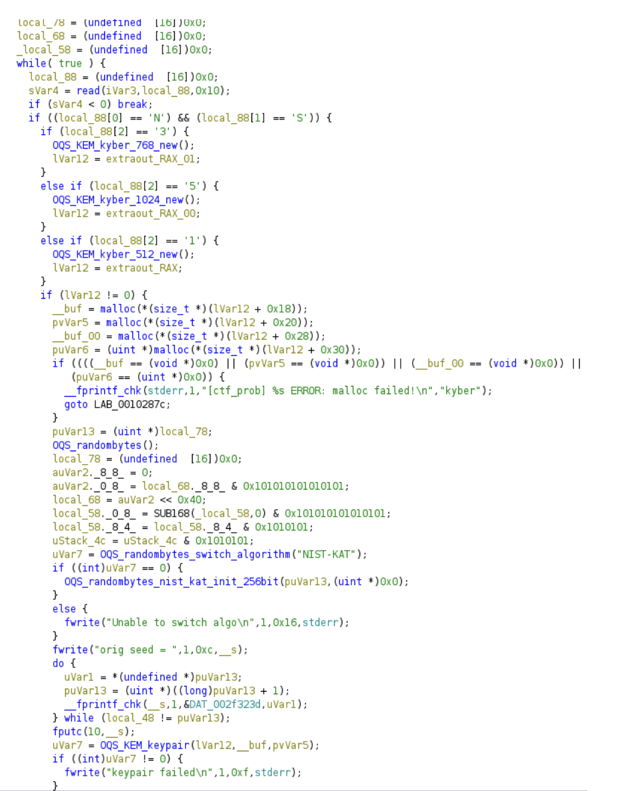
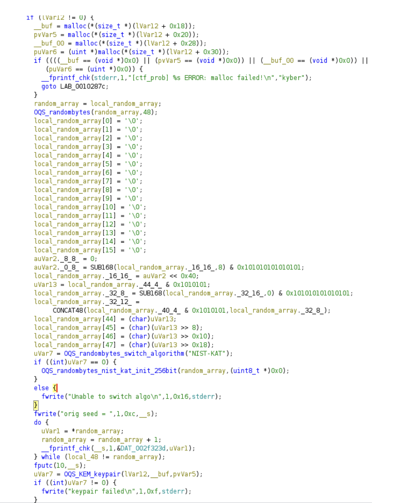
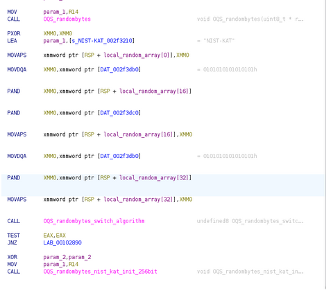
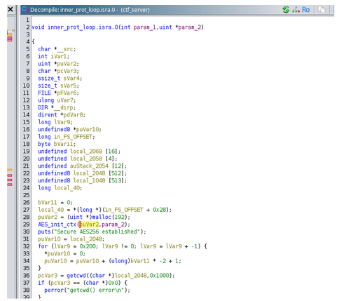
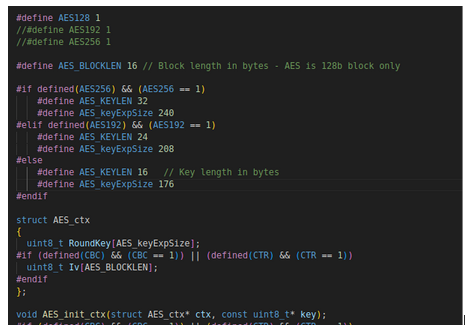
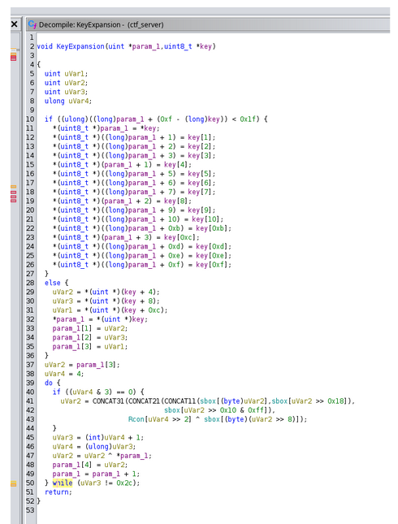

__Solution__

The provided materials are a client and server Ubuntu x64 binaries, as well as a packet capture of some traffic from the PQ-FTP application. We have a description of the network protocol, and know that it does a Kyber KEM handshake and then begins communicating over AES256, with a few different verbs for sending and receiving files as well as performing directory listings. We are told that the AES is in ECB mode with 16 byte blocks, with padding set to 0.

__Finding the Vulnerability__

We are only told that a cryptographic vulnerability exists, but not what it is. However, given there are only two usages of cryptography in the program, a Kyber KEM handshake and an AES tunnel, we can assume that one of those two areas contains the issue.

__Via Inspection__

The vulnerability can be found via inspection with a keen eye.
If you run the server as follows:

```
./ctf_server 
Serving on default port 1337
Socket created
Socket bind succeed
Socket listening
```

You can then connect to it with any of the supported client options, put, get, or dir.

```
./ctf_client NS1 DIR . 127.0.0.1
Secure AES256 established
Current working dir: /home/homedir/CTF_Solution
Sending: DIR
Sending: .
Sending: END
Directory listing of .
ctf_client
.
ctf_server
..
file.pcap
```

On the server side, you will notice the following output:

```
Client connected
orig seed = 000000000000000000000000000000000000000000000000010001000100000001000100010001000001000101010000
Shared secret successfully received
Secure AES256 established
Current working dir: /home/homedir/CTF_Solution
DIR command received, waiting for file name
Directory listing command
Dir open success
ctf_client
.
ctf_server
..
file.pcap
Connection broke before reading 16
Connection broke
Socket created
Socket bind succeed
Socket listening
```
If you run this many times, or even once, you may notice that it outputs the random seed used for the KEM, and that the random isn’t very good. We can see that there are 96 digits output, which corresponds to 48 bytes of hexadecimal output, which matches the size requirements of the  “OQS_randombytes_nist_kate_init_256bit” function in libOQS. Additionally, we see that all bytes above the 24th byte are set to 0, and that the bytes below that are masked to a single bit, creating a random seed of 24-bits.

__Via Reverse Engineering__

If instead you go straight to static analysis, you may load the binaries into Ghidra. If you look at the server binary, you can quickly find the location where the random seed is generated in the main method, as well as the names of functions from libOQS.



The three key functions here are OQS_randombytes, and OQS_randombytes_switch_algorithm(“NIST_KAT”) and OQS_randombytes_nist_kat_init_256bit. NIST_KAT is a deterministic prng that we switch to, but we use the output of OQS_randombytes to generate a real random seed to feed to it. If you were to look up these functions inside of libOQS, you’ll notice tha the function signatures are wrong, which makes Ghidra’s decompiler output a little harder to follow.

The correct function signatures are:

```
OQS_API void OQS_randombytes(uint8_t *random_array, size_t bytes_to_read);
OQS_API void OQS_randombytes_nist_kat_init_256bit(const uint8_t *entropy_input, const uint8_t *personalization_string);
OQS_API OQS_STATUS OQS_randombytes_switch_algorithm(const char *algorithm);
```
You can right click on the functions in Ghidra and select “Edit Function Signature” to correct the function prototypes.
After some editing, the decompiler output will look at follows:



The decompiler output is still a bit messy, but you can see 24-bytes are AND’d with bytes set to 0x01, and the rest of the array is zeroed. This might be easier to parse in the disassembler than in the decompiler output.




There are 128-bit SSE instructions, 16-byte wide, so the operations may get a little confusing.
PXOR is operating on the 128-bit SSE register XMM0, performing the XOR operation to produce a 16 byte wide 0 value. The MOVAPS instruction moves those 16 bytes into the first 16-bytes of our random seed array, zeroing out those bytes. 

Then MODQA accesses the memory containing the 16 bytes of the 0x01 pattern and moves it into the XMM0 register. Then this pattern is applied to 16 bytes of our random array, starting at index 16 storing the result in XMM). Then this value is AND’d with an additional 16 bytes, zeroing out the lower 8 bytes and keeping the higher 16 bytes. It then moves this value back into our array in memory with the MOVAPS instruction. At this point, bytes 0-24 of our 48 byte array are zeroed. 

Next, the MOVDQA instruction loads the 16-byte 0x01 pattern again, and uses the PAND instruction to AND it with the 16 bytes of the array starting at index 32. This value is then moved back into the array from XMM) using the MOVAPS instruction. 

At this point, the lower 24-bytes are zeroes, and the high 24-bytes are whatever was generated by OQS_randombytes with the 0x01 mask applied. This truncated random seed is then loaded in to the OQS_randombytes_nist_kat_init_256bit function to seed the prng.

__Decrypting the Traffic__

Regardless of how you discovered the vulnerability, you likely needed to reverse engineer the binary to determine the call sequence to replicate using libOQS.

When this challenge was written, the libOQS API was slightly different, and the required call to OQS_randombytes_switch_algorithm was removed. You can either revert to an older version of the library where this is available, or it appears there is now an OQS_randombytes_custom_algorithm function that can be used instead, subject to additional API changes in the future.
https://github.com/open-quantum-safe/liboqs/blob/5690baebe4363fb650b128a5c03dc1d7b3eead54/tests/test_helpers.c#L98

For the purposes of this write-up, we will be presenting a solution based on an older version of libOQS.

This is one unintentional additional issue to be solved via reverse engineering first though. While the protocol was mostly described correctly in our write-up and in the strings output by the binary, we used the TinyAES library to write this binary and, unintentionally, our build flag setting AES256 was not picked up by the TinyAES library. So while the binary does provide input from the KEM that should be used for 256-bit AES in a correct implementation, the AES library will only use 128-bits of the key.




If you happen to determine that the AES library in use is TinyAES, you may have been able to figure out that it is in AES128 mode by the size of the AES_ctx structure here, which is 192 bytes, equal to the size of the 128-bit (16 byte) variant.





Otherwise, you’ll need to determine either via debugging or reverse engineering that of the AES_init_ctx function (which resolves to KeyExpansion) that only 16 bytes are in use, creating a non-standard Kyber KEM variant.




Now for the solution itself, you need to do the following (in pseudo code):

1. Parse the pcap file and extract the application layer data.

2. Identify the connection initiation by looking for the NS1, NS3, or NS5 strings.

3. From there, identify the packet that consists of application data that matches the KEM public key in length, and assume it is the corresponding public key.

4. Call OQS_KEM_kyber_new of the appropriate size, switch the random algorithm to NIST_KAT, and seed it with bytes starting incrementing in the pattern determined above, setting each of the first 24-bytes to all possible permutations of 0x1, in odometer style counting where the maximum value for each digit is 0x1.

5. Generate a OQS_KEM_keypair for each “random” array and compare it to the public key from the pcap. When you generate a public key that matches, you will have brute forced the secret key too.

6. Next, look for a packet with an app data length of the ciphertext size from libOQS, for the KEM level we have discovered. Call OQS_KEM_decaps to recover the secret key and initialize AES in ECB mode of the appropriate size, in this case, AES128.

7. Finally, you can decrypt the messages on the wire. You can attempt to decode the commands, but all commands are set in ASCII, and no binary data was transmitted via this PCAP, so you can directly print out everything that was sent.

8. The pcap contains multiple KEM exchanges and multiple AES encryption keys, so you will need to repeat this process for the additional packets in the pcap.

__Step by Step__

1. Parse the pcap file and extract the application layer data.

```
static void packet_handler(u_char *user_data, const struct pcap_pkthdr *pkthdr, const u_char *packet) {
   struct ip* iph;
   struct tcphdr *tcph;
   u_char *app_data;

   //get the IP header
   iph = (struct ip*)(packet +14); //Ethernet header is 14 bytes

   //Get the TCP header
   tcph = (struct tcphdr*)(packet + 14 + iph->ip_hl *4);

   // The application layer data follows the TCP header
   //app_data = (u_char *)(packet + 14 + iph->ip_hl*4 + tcph->doff*4); // TCP header length is in 4-byte words
   // Calculate the length of the application data
   int app_data_len = ntohs(iph->ip_len) - (iph->ip_hl*4 + tcph->doff*4);


   if (PROCESSING_MESSAGE == false)
   {
       printf("\nPacket length: %d\n App data Len %d\n", pkthdr->len,app_data_len);
   }
   // The application layer data follows the TCP header
   if (app_data_len > 0)
   {
       app_data = (u_char *)(packet + 14 + iph->ip_hl*4 + tcph->doff*4); // TCP header length is in 4-byte words
   }
   else
   {
       return;
   }
```
2. Identify the connection initiation by looking for the NS1, NS3, or NS5 strings.

```
if (strncmp(app_data,"NS1\0",4) == 0|| strncmp(app_data,"NS3\0",4) == 0|| strncmp(app_data,"NS5\0",4) == 0)
       {
           if (!PROCESSING_MESSAGE)
               printf("\nKyber KEM initialization found %s\n", app_data);
...
```
3. From there, identify the packet that consists of application data that matches the KEM public key in length, and assume it is the corresponding public key.

```
       else if ((app_data_len== OQS_KEM_kyber_512_length_public_key) || (app_data_len == OQS_KEM_kyber_768_length_public_key) || (app_data_len == OQS_KEM_kyber_1024_length_public_key) && (public_key == NULL))
       {
           if (!PROCESSING_MESSAGE)
               printf("\nProbably the public key\n");

```

4. Call OQS_KEM_kyber_new of the appropriate size, switch the random algorithm to NIST_KAT, and seed it with bytes starting incrementing in the pattern determined above, setting each of the first 24-bytes to all possible permutations of 0x1, in odometer style counting where the maximum value for each digit is 0x1.

```
/odometer style counting
   while(!odometerMax)
   {
       /**
        * Start from the least significant digit (48th).
        * Add 1 to it up to the max value (1 in this case since we masked the random seed with 0x1 before)
        * Return to the least significant digit for counting by 1.
        * If the current digit is at max value, then set it to 0 and move the digit index to the left.
        * That digit will then be incremented, and the counter will return to hte least significant digit.
       */
       curIndex = 47;
       while(curIndex >= 0)
       {
           if (seed[curIndex] < maxVal)
           {
               seed[curIndex] = seed[curIndex] + 1;
               curIndex = 47;
           }
           else if (seed[curIndex] == maxVal)
           {
               seed[curIndex] = 0;
               //carry
               //seed[curIndex - 1] += 1;
               //fprintBstr(fh, "seed = ", seed, 48);
               curIndex = curIndex - 1;
               //fprintBstr(fh, "carry seed = ", seed, 48);


           }
           else{
               printf("Shouldn't be here\n");
               fprintBstr(fh, "seed = ", seed, 48);
               *retVal = 0;
               return;
           }
...
```
5. Generate a OQS_KEM_keypair for each “random” array and compare it to the public key from the pcap. When you generate a public key that matches, you will have brute forced the secret key too.

```
         //Attempt to brute force random seed and recreate the matching secret key for the public key
           OQS_randombytes_nist_kat_init_256bit(seed, NULL);
           OQS_KEM_keypair(kem, public_key, secret_key);
           if (memcmp(public_key, IN_public_key, kem->length_public_key) == 0)
           {
               printf("Identical public keys found, brute forced the secret on iter %lu\n", count);
...

```
6. Next, look for a packet with an app data length of the ciphertext size from libOQS, for the KEM level we have discovered. Call OQS_KEM_decaps to recover the secret key and initialize AES in ECB mode of the appropriate size, in this case, AES128.
```
    else if (public_key != NULL && (app_data_len == kem->length_ciphertext))
       {
           if (!PROCESSING_MESSAGE)
               printf("\nLength of %ld matches ciphertext length\n",kem->length_ciphertext);
           int rc = OQS_KEM_decaps(kem,shared_secret_d,app_data,secret_key);
      if (rc != 0)
           {
               printf("KEM decaps failed\n");
           }
           else
           {
               printf("Recovered shared secret\n");
               ctx = malloc(sizeof(struct AES_ctx));
               AES_init_ctx(ctx, shared_secret_d);
               printf("AES decryption established\n");
           }
           return;
```
7. Finally, you can decrypt the messages on the wire. You can attempt to decode the commands, but all commands are set in ASCII, and no binary data was transmitted via this PCAP, so you can directly print out everything that was sent.

```
else if (ctx != NULL)// && app_data_len == 16)
       {
           if (PROCESSING_MESSAGE == false)
           {
               printf("\n*****Decrypting message\n");
           }
           uint8_t buff[17] = {0};
           for (int x = 0; x < app_data_len; x+=16)
           {
               memcpy(buff, &app_data[x],16);
               AES_ECB_decrypt(ctx, (uint8_t*) buff);
               if (strcmp(buff,"PUT") == 0 || strcmp(buff,"GET") == 0 || strcmp(buff,"DIR") == 0)
    {
                   PROCESSING_MESSAGE = true;
                   printf("Command found %s\n",buff);
               }
               else if (strcmp(buff,"END") == 0)
               {
                   //PROCESSING_MESSAGE = false;
                   printf("\n%s\n*********",buff);
                   printf("END command found\n");
                  
               }//if (PROCESSING_MESSAGE)
               //{
               else {
                   printf("%s",buff);
               }
               //}
               memset(buff, 0, 17);
           }
           return;

```
8. The pcap contains multiple KEM exchanges and multiple AES encryption keys, so you will need to repeat this process for the additional packets in the pcap.

__Final Output__

With your solution, you will see output something like the following:

First public key:

```
Kyber KEM initialization found NS1
Packet length: 66
 App data Len 0

Packet length: 866
 App data Len 800

Probably the public key
Count reached 0
seed = 000000000000000000000000000000000000000000000000000000000000000000000000000000000000000000000001
Count reached 10000000
seed = 000000000000000000000000000000000000000000000000000100000101000000010000010001010001000000010000
Identical public keys found, brute forced the secret on iter 18849669
...

Length of 768 matches ciphertext length
Recovered shared secret
AES decryption established

Packet length: 66
 App data Len 0

Packet length: 114
 App data Len 48

*****Decrypting message
Command found DIR
.
END
*********END command found

...

b.txt
.
d.txt
c.txt
ctf_server
abc
bfg
..
server_secret.txt
a.txt
abc.txt

END
*********END command found

...

Packet length: 1250
 App data Len 1184

Probably the public key
Count reached 0
seed = 000000000000000000000000000000000000000000000000000000000000000000000000000000000000000000000001
Count reached 10000000
seed = 000000000000000000000000000000000000000000000000000100000101000000010000010001010001000000010000
Count reached 20000000
seed = 000000000000000000000000000000000000000000000000010000010100000001000001000101000100000000010000
Identical public keys found, brute forced the secret on iter 28022890

...
Length of 1088 matches ciphertext length
Recovered shared secret
AES decryption established

Packet length: 162
 App data Len 96

*****Decrypting message
Command found PUT
client_secret.txt
END
*********END command found
1337h@x0r

END
*********END command found

...
Packet length: 1634
 App data Len 1568

Probably the public key
Count reached 0
seed = 000000000000000000000000000000000000000000000000000000000000000000000000000000000000000000000001
Count reached 10000000
seed = 000000000000000000000000000000000000000000000000000100000101000000010000010001010001000000010000
Count reached 20000000
seed = 000000000000000000000000000000000000000000000000010000010100000001000001000101000100000000010000
Count reached 30000000
seed = 000000000000000000000000000000000000000000000000010101000001000001010100000000010101000000010101
Identical public keys found, brute forced the secret on iter 32571718
...
Packet length: 1634
 App data Len 1568

Length of 1568 matches ciphertext length
Recovered shared secret
AES decryption established
...
*****Decrypting message
Command found DIR
.
END
*********END command found
b.txt
.
d.txt
c.txt
ctf_server
client_secret.txt
abc
bfg
..
server_secret.txt
a.txt
abc.txt

END
*********END command found
...
Probably the public key
Count reached 0
seed = 000000000000000000000000000000000000000000000000000000000000000000000000000000000000000000000001
Identical public keys found, brute forced the secret on iter 3103836
...
Packet length: 1634
 App data Len 1568

Length of 1568 matches ciphertext length
Recovered shared secret
AES decryption established
...
*****Decrypting message
Command found GET
server_secret.txt
END
*********END command found
My v0ice is my p@ssport.

END
*********END command found

 Pcap parsing complete.

```
The key output here is the 1337 speak and the classic hacker movie quote, so your final answers are:
```
1337h@x0r
My v0ice is my p@ssport.
```
